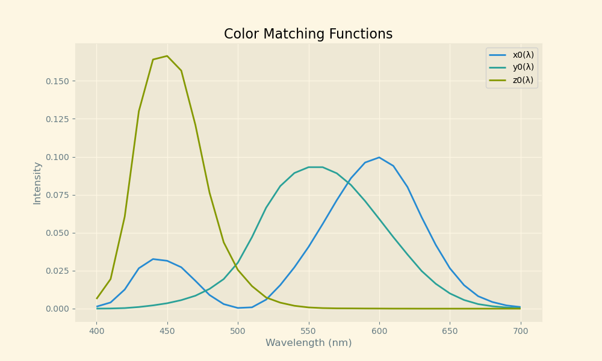
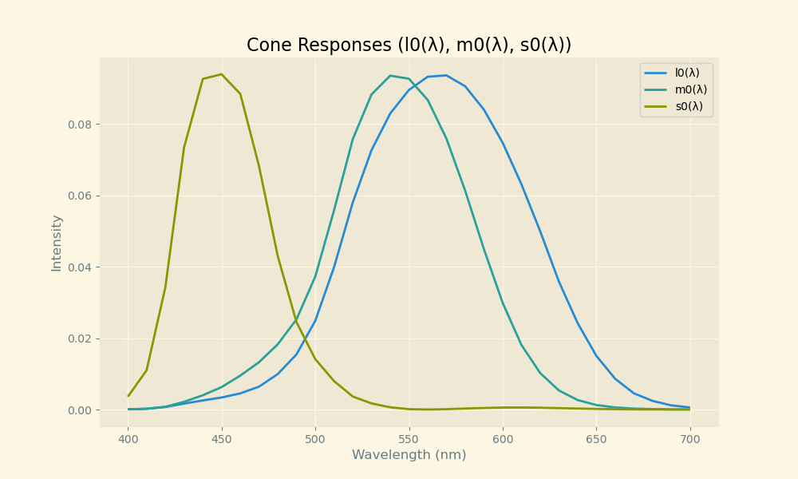
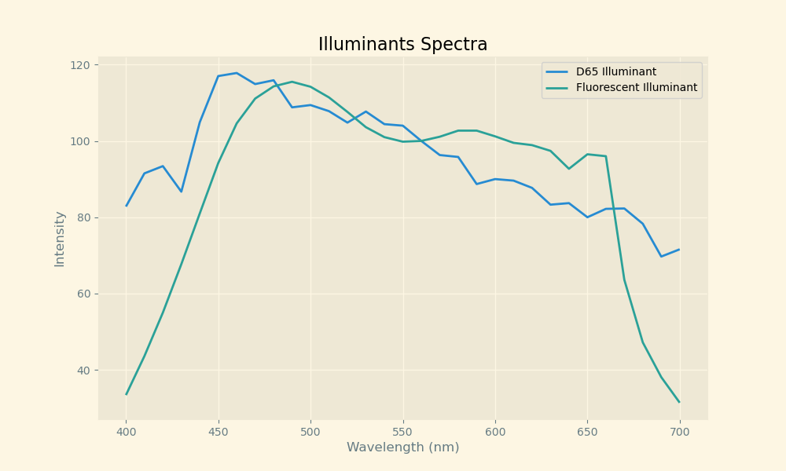
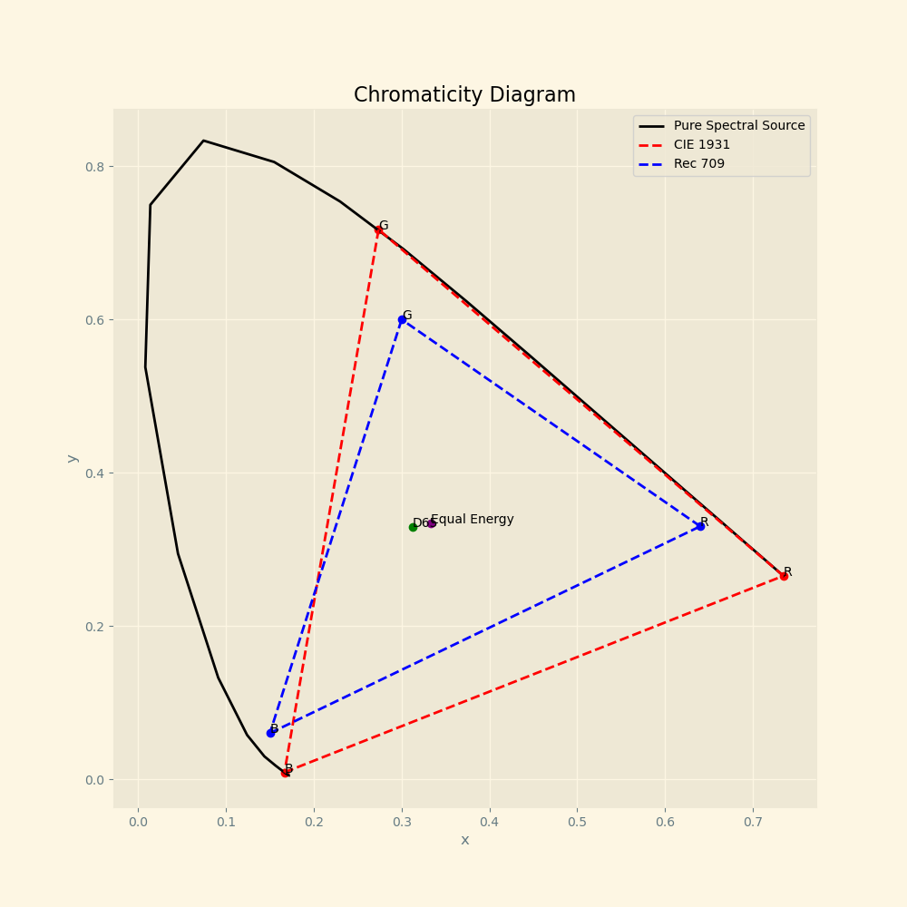
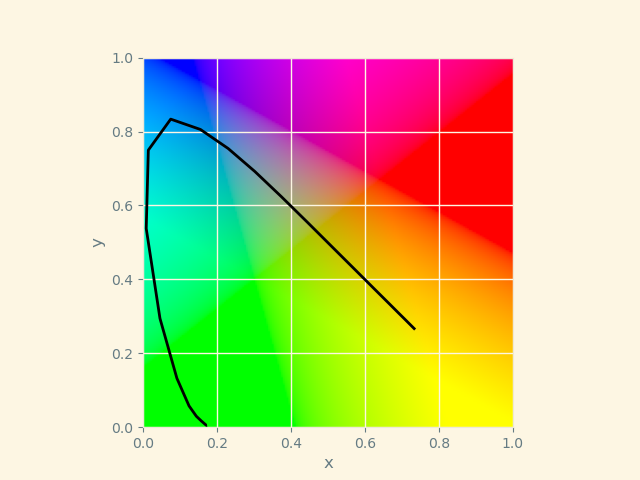

## Introduction to Colorimetry

### Plotting Color Matching Functions and Illuminants







### Chromaticity Diagrams



### Rendering an Image from Illuminant, Reflectance, and Color Matching Functions

```py
Transformation matrix M_709_D65:
[[0.4123908  0.35758434 0.18048079]
 [0.21263901 0.71516868 0.07219232]
 [0.01933082 0.11919478 0.95053215]]
 ```

#### D65 Light Source Render


#### Flourescent Light Source Render


#### Qualitative Difference

The D65 light source is preferred for its balanced spectrum and natural color rendition, while the flourescent source introduces color inaccuracies. The flourescent source appears to create an image that is cooler or greener in the mid tones, and is overall less vibrant than the D65 source render.

### Color Chromaticity Diagram



